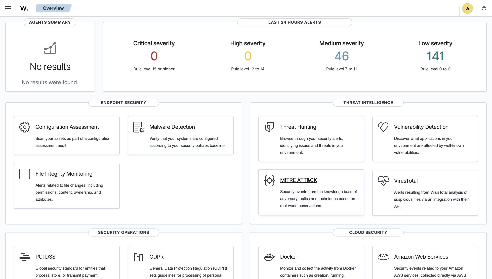

# Wazuh Home SOC Lab

## Mac M4 | Docker | OrbStack | 2 Linux Endpoints

## Project Overview

Built a home SOC lab running Wazuh SIEM via Docker,

monitoring two Linux endpoints to simulate real SOC analyst workflows.

## Architecture

- Wazuh Server: Docker on Mac M4

- Monitored Endpoints: 2 Linux VMs via OrbStack

- novatech-web: Ubuntu 22.04

- novatech-db: Debian 12

## Project Phases

- Phase 1 — SOC Lab Setup

- Phase 2 — Threat Detection & Alert Tuning

- Phase 3 — Compliance Monitoring

- Phase 4 — Incident Response Simulation

## Tools Used

| Tool                            | Purpose                                                        |

|----------------------|-------------------------------------------- |

| Wazuh 4.7              | SIEM platform                                            |

| Docker Desktop| Container runtime                                   |

| OrbStack               | VM management on Apple Silicon |

## Dashboard Screenshot

